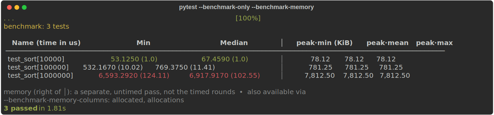

# Quickstart

pytest-benchmem is a **drop-in** for an existing pytest-benchmark suite: add one flag and
every `benchmark(...)` call records peak memory too — no test changes. The memray pass is
Linux/macOS only; timing works everywhere.

## 1. You already have a benchmark

A normal pytest-benchmark test — nothing pytest-benchmem-specific. If you have a suite
already, you're done with this step:

```python
# test_sortbench.py
import pytest


@pytest.mark.parametrize("n", [10_000, 100_000, 1_000_000])
def test_sort(benchmark, n):
    benchmark(sorted, list(range(n, 0, -1)))
```

## 2. Run it with `--benchmark-memory`

Add the flag and peak memory appends to pytest-benchmark's own table — the
`peak` columns land right of the `│` divider, after the timing columns:

<figure class="termshot" markdown="span">

</figure>
That's it. Left of the divider is pytest-benchmark's timing, untouched; `peak` (right) is a
separate, untimed memray pass on the same call — so the allocator hooks cost the timing
nothing. It's opt-in at the run level: **without** the flag, your suite runs exactly as
before. Add `--benchmark-json=run.json` to save both metrics to one file.

## 3. Where to go next

- The point of the tool — **find where the memory goes** → [Find where memory goes](profiling.md)
- Confirm a fix by diffing two runs → [Compare two runs](compare-runs.md)
- Want `allocated` / `allocations` too, or a different table layout? → [Choosing a metric](metrics.md)
- Slice tables and plots by an axis (input size, op, …) → [Grouping by dims](dims.md)
- Newer — fail CI on a memory regression → [Catch regressions in CI](catch-regressions.md)

---

## Going further

!!! tip "Want memory on specific tests only? Use the `benchmark_memory` fixture"
    `--benchmark-memory` measures the whole suite. To opt **in** per test instead — no
    run-level flag — swap `benchmark` for `benchmark_memory` on just those tests; it's
    always measured:

    ```python
    def test_sort(benchmark_memory, n):
        benchmark_memory(sorted, list(range(n, 0, -1)))
    ```

    The fixture also gives you the [`pedantic` form](reference.md#the-benchmark_memory-fixture)
    for explicit control (a `setup` that rebuilds fresh state each round, custom rounds).

!!! warning "Stateful benchmarks: reuse your `setup`"
    Memory rides a *separate*, untimed invocation, **sampled several times** (adaptive) — so a
    **stateful** action (mutates a fixture, fills a cache on a carried-over object) *drifts*
    across those samples (the first fills the state, later ones reuse it) instead of reporting
    the cold cost on each.

    The fix is **free if you already do it for timing**: a `setup` passed to the
    [`pedantic` form](reference.md#the-benchmark_memory-fixture) — or to `benchmark.pedantic`
    under `--benchmark-memory` — is **reused, untracked, before each memory sample**, so
    `setup`-based suites stay accurate with **no extra changes**. Otherwise, benchmark a pure
    call, or add such a `setup`.
