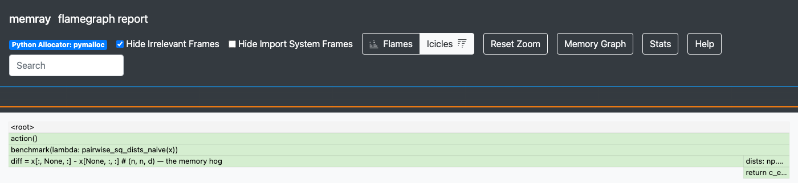
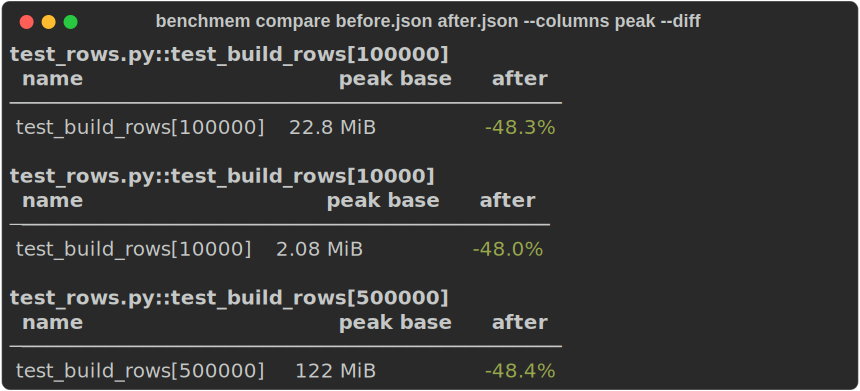

# pytest-benchmem

**On-demand memory profiling for your benchmarks.** Measure how much memory your code actually
uses — and see *where* it goes — on the same benchmarks you already time. For Python libraries and
pipelines where memory is a real constraint: large numpy arrays, pandas frames, solvers,
C/Cython/Rust extensions. Find the heavy path, fix it, confirm the drop.

It builds on [pytest-benchmark](https://pytest-benchmark.readthedocs.io). Take an existing
test — you don't change it:

```python
@pytest.mark.parametrize("n", [10_000, 100_000, 1_000_000])
def test_sort(benchmark, n):          # your existing pytest-benchmark test, unchanged
    benchmark(sorted, list(range(n, 0, -1)))
```

Add one flag, and peak memory appears in pytest-benchmark's own table, after the timing
columns. Same test, same run, one JSON file, no second tool:

<figure class="termshot" markdown="span">

</figure>
[Quickstart →](getting-started.md){ .md-button .md-button--primary }

## Find where the memory goes

A peak number tells you *which* benchmark is heavy, not *where* the memory goes. Keep the memray
profile for the offenders and render the allocating call paths — the heart of the tool:

```bash
pytest --benchmark-only --benchmark-memory --benchmark-memory-profile profiles/
benchmem flamegraph profiles/ --worst peak --open
```

The flamegraph renders the allocating call paths — here a naive pairwise-distance function's
`(n, n, d)` broadcast line spans the full width, i.e. **94% of peak** in a single line
(the [profiling guide](profiling.md) breaks down the same run frame by frame):

{ .flameshot }
Then change the code, re-run, and diff the two runs to confirm the peak actually dropped
(green is a shrink):

```bash
benchmem compare before.json after.json --columns peak --diff
```

<figure class="termshot" markdown="span">

</figure>
## Is this for you?

**Yes, if** you maintain code where memory is a real constraint — large arrays, dataframes,
solvers, C/Rust extensions — and you want to *find* what's heavy, *see* where it allocates (at
allocator precision, not RSS sampling), and *confirm* a fix, on the benchmarks you already time.

**Look elsewhere when** you want a whole-test memory limit or leak check rather than a
number on one benchmarked call — that's [pytest-memray](https://pytest-memray.readthedocs.io).
For **continuous CI tracking** (history, dashboards, PR annotations), reach for
[CodSpeed](https://codspeed.io) — it runs the same pytest-benchmark `benchmark()` tests, so one set
of benchmarks serves both. For where it sits against ASV, CodSpeed, and plain memray, see the
[README](https://github.com/fluxopt/pytest-benchmem#why-memray-and-where-it-sits).

!!! note "Want memory on specific tests only?"
    `--benchmark-memory` measures the whole suite. To opt in per test instead, swap
    `benchmark` for the `benchmark_memory` fixture on just those tests — it's always
    measured, and adds a `pedantic` form for explicit control. See the
    [Quickstart](getting-started.md).

## Install

=== "Core"

    The `benchmark_memory` fixture + the memray engine.

    ```bash
    uv add pytest-benchmem
    ```

=== "With plots & CLI"

    Adds the `benchmem` compare/plot/sweep CLI (pandas, plotly, typer).

    ```bash
    uv add "pytest-benchmem[plot]"
    ```

pytest-benchmark and memray are core deps. The memory pass needs memray, which is
**Linux/macOS only** — timing works everywhere.

## Where to next

The core loop — measure, find, fix:

| If you want to… | Go to |
|---|---|
| Run your first benchmark and read both metrics | [Quickstart](getting-started.md) |
| Find where the memory actually goes | [Find where memory goes](profiling.md) |
| Confirm a fix — diff two runs and see what moved | [Compare two runs](compare-runs.md) |
| Know which of peak / allocated / allocations / rss to track | [Choosing a metric](metrics.md) |
| Slice tables and plots by an axis (input size, op, …) | [Grouping by dims](dims.md) |
| Look up a specific flag, marker, or function | [Reference](reference.md) |

Newer, less battle-tested — feedback welcome:

| If you want to… | Go to |
|---|---|
| Fail CI when memory grows, or cap it at a budget | [Catch regressions in CI](catch-regressions.md) |
| Chart memory across inputs | [Visualize memory](visualize.ipynb) |
| Benchmark across installed versions of a package | [Compare across versions](sweeps.md) |

## Status

Early. Extracted from the linopy internal benchmark suite, where it's the local
memory-profiling layer. The measure → profile → fix loop is the hardened core; the newer
features may move before 1.0.
