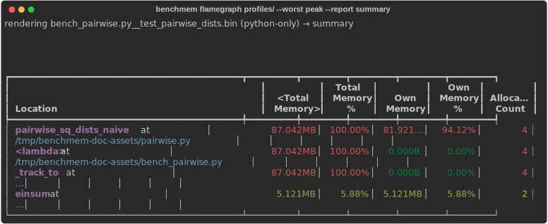

# Find where memory goes

This is the heart of pytest-benchmem. A peak number tells you *which* benchmark is heavy, not
*where* the memory goes — so keep the memray profile for it and render the allocating call paths.
Now you know exactly what to optimize; change the code, re-run, and
[confirm the drop](compare-runs.md).

## Keep a profile for the offenders

Add `--benchmark-memory-profile DIR` to keep the memray profile (`.bin`) for each regressing id:

```bash
pytest --benchmark-only --benchmark-memory \
       --benchmark-memory-compare-fail=peak:10% \
       --benchmark-memory-profile profiles/
# -> profiles/<id>.bin for every id over threshold; clean ids get nothing
```

The run prints a ready-to-paste command per saved profile:

```text
benchmem: saved 1 memory profile(s) to profiles/ — render with:
    memray flamegraph profiles/test_solve.bin
```

The `.bin` is memray's raw capture, so the same file also feeds `memray tree` / `summary` / `stats`
— pick the lens you want. Off by default (retaining `.bin`s costs disk), and in CI it's the natural
artifact to upload and render locally on the PR.

**Which benchmarks get a profile** follows the gate:

- **with** `--benchmark-memory-compare-fail` → only the **regressing** ids (keep the failing run
  cheap and the output small);
- **without** a fail-gate → **every measured benchmark** — drop the gate and keep
  `--benchmark-memory-profile DIR` alone to archive them all, regressing or not.

## One-step render — `benchmem flamegraph`

Instead of finding the right `.bin` and remembering the memray subcommand, point `benchmem
flamegraph` at the profile dir and name the test (an exact id or a unique substring):

```bash
benchmem flamegraph profiles/ test_solve          # → profiles/test_solve.flamegraph.html
benchmem flamegraph profiles/ --worst peak --open # auto-pick the heaviest, open it
benchmem flamegraph profiles/ test_solve --report tree   # terminal lens instead of HTML
```

`--worst peak|allocated|allocations` reads the metric straight from each `.bin` and renders the
heaviest, so you don't have to look up the id. `--report` passes through to any memray reporter
(`flamegraph` default, plus `table` / `tree` / `summary` / `stats`); HTML reports land next to the
`.bin` (override with `-o`, overwrite with `-f`).

## A worked example — building a k-d tree

The captures below profile a real, tested function
([`examples/kdtree.py`](https://github.com/fluxopt/pytest-benchmem/blob/main/examples/kdtree.py)):
building a 2-D k-d tree, which recursively splits points by alternating axes — the backbone of
nearest-neighbour search. The naive build commits a classic mistake: every node keeps a reference
to the whole sublist it was split from, so the finished tree retains `O(n·log n)` points instead
of `O(n)`.

```python
def build_kdtree_naive(points, depth=0):
    if not points:
        return None
    ordered = sorted(points, key=lambda p: p[depth % 2])
    mid = len(ordered) // 2
    node = RegionNode(ordered[mid], ordered)   # ← the leak: keeps the whole sublist alive
    node.left = build_kdtree_naive(ordered[:mid], depth + 1)
    node.right = build_kdtree_naive(ordered[mid + 1 :], depth + 1)
    return node
```

Because the work is recursive, the flamegraph is a proper tree — every `build_kdtree_naive` frame
is a subtree, and the per-level `sorted(...)` and slice allocations are what pile up:

{ .flameshot }

`summary` is the fastest read in the terminal — it ranks every frame by the memory it owns, so the
offender tops the **Own Memory %** column. Here `build_kdtree_naive` owns **95% of peak** — the
retained sublists:

<figure class="termshot" markdown="span">

</figure>

The fix keeps only the split point and its children — nothing else is retained:

```python
def build_kdtree(points, depth=0):
    if not points:
        return None
    ordered = sorted(points, key=lambda p: p[depth % 2])
    mid = len(ordered) // 2
    return Node(
        ordered[mid],
        build_kdtree(ordered[:mid], depth + 1),
        build_kdtree(ordered[mid + 1 :], depth + 1),
    )
```

Re-run and [confirm the drop](compare-runs.md) — peak falls by ~80% (the tree is back to `O(n)`),
and the test asserts both builds produce the identical tree.

## Native-backed workloads: attribute the C/Rust memory

By default the capture records **Python** frames only. For a native-backed workload (polars/Rust,
numpy/C, solver bindings) the bulk of peak memory is allocated *inside* the extension, so the
flamegraph collapses it into one unresolved `??? at ???` bucket — exactly the part you wanted to
localize. Add `--benchmark-memory-profile-native` to also capture native stacks:

```bash
pytest --benchmark-only --benchmark-memory \
       --benchmark-memory-profile profiles/ \
       --benchmark-memory-profile-native
```

Now the flamegraph attributes memory to the real frames (e.g. jemalloc `_rjem_je_*` under `rayon`
workers, reached via the polars write path) instead of an opaque native bucket. It's **opt-in** —
native traces cost runtime and produce bigger `.bin`s — and only applies on the
`--benchmark-memory-profile` path. Scope it to one test with
`@pytest.mark.benchmem(profile_native=True)` instead of the suite-wide flag; `benchmem flamegraph
--native` asserts a profile actually carries native traces and errors with the fix if it doesn't.

!!! note "Symbols sharpen native frames"
    Native traces resolve against interpreter/library symbols. On a stripped build memray warns
    `No symbol information was found for the Python interpreter`; frames then show as mangled
    Rust/`<unknown>` but stay attributable by symbol name (`_rjem_je_*`, `rayon_*`). A debug-symbol
    interpreter sharpens the picture.

## Where to go next

- Set up the gate that flags the offenders → [Catch regressions in CI](catch-regressions.md)
- See the before/after numbers that pointed here → [Compare two runs](compare-runs.md)
